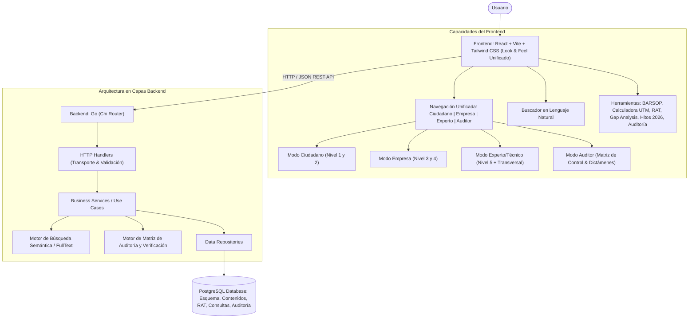
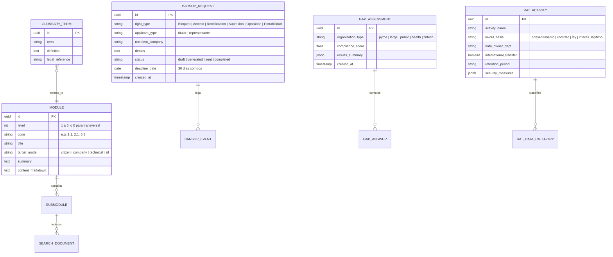

# 🏛️ PO — Arquitectura, Topología y Diseño de Sistema

## 🌐 Visión General
**PO (Protección & Obligaciones)** es una plataforma web interactiva diseñada para la comprensión, implementación y cumplimiento de la **Nueva Ley de Protección de Datos Personales de Chile** (con fecha de entrada en vigencia el **1 de diciembre de 2026**).

La plataforma resuelve la asimetría de información y la complejidad técnica-normativa a través de tres experiencias adaptadas (Ciudadano, Empresa y Experto Técnico), un motor de búsqueda inteligente en lenguaje natural, herramientas interactivas de diagnóstico (Gap Analysis, RAT, Asistente BARSOP) y un sistema de seguimiento de hitos con contador regresivo.



---

## 🎨 Principios de Diseño & Look and Feel
* **Estilo Visual:** Minimalista, elegante y sobrio (Slate/Zinc neutrales, acentos en Azul Índigo / Esmeralda institucional).
* **Consistencia:** Tipografía clara, jerarquía visual limpia, bordes sutiles (`border-slate-800`/`border-slate-200`), modo oscuro refinado por defecto con soporte claro.
* **Componentes Compartidos:** Misma cabecera con contador de hitos 2026, barra de búsqueda omnisciente y barra de cambio de modo de navegación instantáneo sin recarga.

---

## 🧭 Modos de Navegación & Matriz de Niveles

| Modo | Audiencia Objetivo | Niveles de Contenido Accesibles | Enfoque Principal |
| :--- | :--- | :--- | :--- |
| **👤 Ciudadano** | Personas naturales, titulares de datos | **Nivel 1 + Nivel 2** | Conocer derechos BARSOP, cómo solicitar acceso/borrado, plazos legales (30 días), generador de cartas/solicitudes. |
| **🏢 Empresa** | Directores, gerentes, oficiales de cumplimiento, PyMEs | **Nivel 3 + Nivel 4** | Bases de licitud, deber de seguridad, notificación de brechas (72h), RAT, designación de DPD, evaluación de impacto. |
| **⚙️ Experto / Técnico** | Ingenieros de software, DevOps, arquitectos TI | **Nivel 5 + Transversal** | Flujos de datos, cifrado, anonimización, APIs, checklists técnicos por industria, multas hasta 20.000 UTM y 4% ingresos. |
| **🕵️ Auditor / Compliance** | Auditores internos/externos, inspectores y DPDs | **Matriz de Control Transversal + 5 Niveles** | Matriz de cumplimiento legal, verificación de evidencias, trazabilidad de plazos BARSOP (30 días), DPA y dictamen de conformidad. |

---

## 📚 Estructura de Conocimiento y Módulos de la Ley

### 1. Nivel 1 – Fundamento (Lo más general)
* **1.1. Objeto y ámbito de aplicación:** Regulación de personas naturales, aplicación a entes públicos y privados, vigencia: **1 de diciembre de 2026**.
* **1.2. Glosario de términos clave:** Dato personal, dato sensible, responsable, encargado, titular, tratamiento, consentimiento, cesión, etc.
* **1.3. Contexto y principios rectores:** Licitud, finalidad, proporcionalidad, calidad, responsabilidad proactiva (accountability), seguridad, transparencia y confidencialidad.

### 2. Nivel 2 – Derechos de los Titulares (BARSOP)
* **2.1. Catálogo de derechos (BARSOP):**
  * **B**loqueo (suspensión temporal del tratamiento).
  * **A**cceso (confirmación, origen, destino, retención).
  * **R**ectificación (corrección de datos inexactos o incompletos).
  * **S**upresión (derecho al olvido / borrado bajo causales).
  * **O**posición (negarse a tratamientos específicos, e.g. marketing).
  * **P**ortabilidad (entrega en formato interoperable/estructurado).
* **2.2. Derecho de acceso en profundidad:** Detalle de requisitos de información exigibles.
* **2.3. Derecho de portabilidad:** Formatos técnicos (JSON, CSV estructurado, interoperabilidad).
* **2.4. Ejercicio de derechos:** Regla de 30 días corridos, gratuidad del trámite, canales electrónicos obligatorios.
* **2.5. Casos prácticos interactivos:** Escenarios reales explicados paso a paso.

### 3. Nivel 3 – Obligaciones de las Organizaciones
* **3.1. Principios de tratamiento & Bases de licitud:** Consentimiento expreso, cumplimiento contractual, obligación legal, interés legítimo.
* **3.2. Deber de información (Transparencia):** Avisos de privacidad claros en capas (Layered Privacy Notices).
* **3.3. Deber de seguridad:** Medidas técnicas y organizativas adecuadas al riesgo.
* **3.4. Notificación de brechas:** Obligación de notificación a la Agencia de Protección de Datos sin dilación indebida.
* **3.5. Responsabilidad proactiva (Accountability):** Demostrar y documentar el cumplimiento constante.
* **3.6. Relación Responsable-Encargado (DPA):** Cláusulas contractuales mandatorias y auditoría de proveedores.

### 4. Nivel 4 – Gobernanza y Cumplimiento
* **4.1. Registro de Actividades de Tratamiento (RAT):** Inventario unificado de bases de datos y finalidades.
* **4.2. Análisis de Brechas (Gap Analysis):** Diagnóstico del estado actual vs requerimientos de la ley.
* **4.3. Política de Protección de Datos:** Plantillas y directrices de políticas corporativas.
* **4.4. Designación del DPD (Delegado de Protección de Datos):** Criterios de obligatoriedad, funciones y estatuto de independencia.
* **4.5. Evaluación de Impacto en Protección de Datos (EIPD / DPIA):** Metodología de análisis previo en tratamientos de alto riesgo.
* **4.6. Gestión de Riesgos:** Matriz de probabilidad e impacto para privacidad.
* **4.7. Plan de Respuesta a Incidentes:** Protocolo escalonado de contención y reporte en plazo máximo legal de **72 horas**.

### 5. Nivel 5 – Aspectos Técnicos y Operativos
* **5.1. Arquitectura de Datos:** Mapeo de flujos (*Data Flow Mapping*), almacenamiento, tránsito y control de fronteras.
* **5.2. Medidas de Seguridad Técnicas:** Cifrado en reposo (AES-256) y en tránsito (TLS 1.3), seudonimización, hashing, auditoría de logs inmutables.
* **5.3. Gestión de Consentimientos:** Arquitectura de captura, versionado, trazabilidad y revocación granular.
* **5.4. Portal Ciudadano (ARCO / BARSOP):** Especificación funcional y de integración para portales de autoservicio.
* **5.5. Automatización de Respuestas:** SLA tracking y pipelines de extracción de datos personales.
* **5.6. Notificación Automática de Brechas:** Monitor de eventos de seguridad y generación de informes de incidentes.
* **5.7. Integración con la Agencia:** Formatos de interoperabilidad y modelos de reporte.
* **5.8. Checklists por Tipo de Organización:** Listas de verificación dinámicas para PyMEs, Grandes Empresas, Sector Público, Salud, Fintech y Educación.

### ⚖️ Nivel Transversal – Supervisión y Sanciones
* **Agencia de Protección de Datos Personales:** Atribuciones normativas, fiscalizadoras y sancionatorias.
* **Régimen Sancionatorio:**
  * Infracciones leves, graves y gravísimas.
  * Multas de hasta **20.000 UTM** (Unidades Tributarias Mensuales).
  * Multas agravadas de hasta el **4% de los ingresos anuales** por ventas o servicios del infractor en caso de reincidencia.
  * Calculadora interactiva de exposición a sanciones.

---

## 📂 Mapa del Repositorio

```
PO/
├── .agent/                      # Memoria viva y reglas del asistente
│   ├── ARCHITECTURE.md          # Arquitectura, módulos y modelos (este archivo)
│   ├── RULES.md                 # Convenciones técnicas y restricciones
│   └── STATE.md                 # Estado del sprint y backlog
├── backend/                     # Servidor API en Go
│   ├── cmd/
│   │   └── server/
│   │       └── main.go          # Punto de entrada HTTP
│   ├── internal/
│   │   ├── domain/              # Modelos de dominio y contratos (Entities)
│   │   ├── handlers/            # Controladores HTTP (Chi Router)
│   │   ├── services/            # Lógica de negocio (Search, BARSOP, Gap, RAT, Sanciones)
│   │   ├── repositories/        # Persistencia en PostgreSQL
│   │   └── search/              # Motor de indexación y búsqueda en lenguaje natural
│   ├── migrations/              # Scripts de migración SQL
│   ├── go.mod
│   └── go.sum
├── frontend/                    # Single Page Application en React + Vite
│   ├── src/
│   │   ├── assets/              # Estilos e imágenes
│   │   ├── components/          # Componentes reutilizables (Navbar, Countdown, SearchBar, Modals)
│   │   │   ├── common/          # UI Base (Button, Card, Badge, Modal, Tabs)
│   │   │   ├── citizen/         # BARSOP Wizard, Plantillas de Solicitud
│   │   │   ├── company/         # Gap Analysis, RAT Builder, Calculadora Sanciones
│   │   │   └── technical/       # Checklists interactivos, Diagramas de flujo
│   │   ├── data/                # Catálogo estructurado de los 5 niveles de conocimiento
│   │   ├── pages/               # Vistas principales (Home, Modos, Módulos, Herramientas)
│   │   ├── hooks/               # Custom hooks de búsqueda y estado
│   │   ├── types/               # Tipos TypeScript para módulos, BARSOP, evaluaciones
│   │   ├── App.tsx
│   │   └── main.tsx
│   ├── package.json
│   ├── tailwind.config.js
│   ├── tsconfig.json
│   └── vite.config.ts
├── scripts/
│   ├── dev.sh                   # Iniciar Backend y Frontend en paralelo
│   ├── build.sh                 # Compilar binario Go y bundle frontend
│   └── deploy.sh                # Script de despliegue
├── .gitignore
└── README.md
```

---

## 🗄️ Entidades Clave de Base de Datos (PostgreSQL)



---

## 🔗 Endpoints Clave de la API REST

### 1. Sistema & Metadatos
* `GET /health` — Verificación de estado del servidor.
* `GET /api/v1/countdown` — Información de vigencia (1 de diciembre de 2026), días restantes e hitos temporales.

### 2. Contenidos & Módulos
* `GET /api/v1/modules` — Listado jerárquico de niveles y submódulos (filtrables por `mode=citizen|company|technical`).
* `GET /api/v1/modules/:code` — Contenido detallado, casos prácticos y referencias legales de un módulo específico.
* `GET /api/v1/glossary` — Glosario completo de términos con búsqueda por término o concepto.

### 3. Buscador Inteligente en Lenguaje Natural
* `GET /api/v1/search?q=:query` — Búsqueda en lenguaje natural que clasifica la intención (consulta de derecho, duda corporativa, requerimiento técnico) y retorna módulos, artículos y acciones sugeridas.

### 4. Herramientas Interactivas
* `POST /api/v1/barsop/generate` — Asistente que valida los datos y genera el documento formal de solicitud de derechos con cálculo de plazo legal (30 días).
* `POST /api/v1/gap-analysis/evaluate` — Procesa las respuestas del cuestionario de madurez y genera informe de brechas y plan de acción.
* `GET /api/v1/checklists/:industryType` — Obtiene la lista de verificación personalizada para el tipo de organización.
* `POST /api/v1/sanctions/calculate` — Calcula la exposición a multas en UTM y % de facturación según gravedad y reincidencia.
* `GET /api/v1/audit/matrix` — Matriz de controles de auditoría por principio legal y nivel de riesgo.
* `POST /api/v1/audit/evaluate` — Evaluación de evidencias de auditoría y cálculo de dictamen de conformidad.
